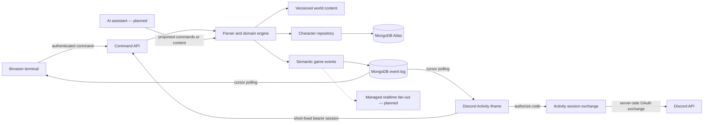

# Architecture

## Status

This document separates the implemented foundation from the target production architecture. The current slice is deliberately small, but its boundaries are intended to survive the next milestones.

## System shape



The command engine does not render HTML and does not depend on React, Vercel, MongoDB, or an AI provider. It accepts state plus text and returns next state plus semantic messages. Discipline rules and item definitions are pure data modules; NPCs, creatures, loot references, quests, and dialogue live in the validated world pack.

## Implemented request path

1. The client posts only a text command.
2. The identity boundary resolves either a Better Auth cookie or a short-lived, opaque Discord Activity bearer session.
3. The repository loads a versioned character snapshot.
4. The domain engine parses and applies the command.
5. The repository commits only if the stored version still matches.
6. The API returns semantic messages and a minimal status summary.
7. The client maps message tones to its chosen color theme.
8. Room-aware actions append semantic events; clients poll forward from opaque cursors and never replay their own event as a duplicate.

Discipline selection is a separate authenticated compare-and-set mutation. It grants starter equipment and establishes authoritative attributes, armor training, resistances, HP, and optional mana before the command terminal opens. A revision number supports an intentional one-time re-selection when the alpha roster changes without weakening the normal permanence rule.

Active combat persists creature HP, attack intent, a deterministic roll sequence, and the next player/creature attack timestamps. The client polls an authenticated combat endpoint only while engagement exists. Each request derives due events and commits through optimistic concurrency; Vercel never needs a durable process or in-memory combat timer. `STOP` clears player attack intent but preserves the creature's schedule.

The compare-and-set commit prevents two concurrent requests from overwriting each other. The route retries a conflicting command from the newest state a limited number of times.

## Runtime strategy

The first deployment target is Next.js on Vercel using the Node runtime. MongoDB Atlas stores durable state. A reused `MongoClient` avoids opening a new pool for every request.

The world does not require a permanent high-frequency loop. Cooldowns, regeneration, respawns, and timed effects should be derived from timestamps when possible. Work that truly must occur without a player request should use a durable job system rather than an in-memory timer.

Shared Room Alpha uses three-second cursor polling for room events and fifteen-second presence heartbeats. Presence expires after forty-five seconds, while explicit movement and sign-out publish immediate departure events. WebSocket handlers must not own durable room or character state because serverless instances are not sticky. A managed realtime layer can later replace polling without changing event storage or command semantics.

## Data ownership

Planned collections:

| Collection | Purpose |
|---|---|
| `user`, `session`, `account`, `verification` | Web authentication records managed by Better Auth |
| `activity_sessions` | Hashed, expiring bearer sessions for the Discord iframe |
| `characters` | Authoritative character snapshots, discipline, progression, equipment, quests, and optimistic version |
| `world_packs` | Published content versions and metadata |
| `game_events` | Seven-day append-only room event feed and future audit/fan-out source |
| `scripts` | Player automation source, compiled form, permissions, and limits |
| `script_runs` | Durable execution state if offline automation is introduced |
| `room_presence` | Ephemeral room membership with automatic expiration |
| `rate_limits` | Expiring fixed-window command and social limits |

Avoid a single world document. Rooms, entities, and published packs need stable identifiers. Hot mutable state should remain separate from mostly immutable content.

## Authentication plan

Production web authentication uses Better Auth with its MongoDB adapter and Discord OAuth. Inside Discord, the Embedded App SDK supplies a one-time authorization code; the server exchanges and verifies it before issuing a short-lived opaque game session. Both routes derive the same player ID from the verified Discord user ID. The alpha permits one account-owned character.

Account identity, account handle, and character name are separate concepts. Availability endpoints improve UX, while MongoDB unique indexes provide the actual uniqueness guarantee. Handles are normalized for comparison and preserved separately for display.

Character reads pass through a backward-compatible normalizer. Fields added by the First Adventure receive safe defaults and legacy inventory labels become stable item IDs. A later successful optimistic commit stores the upgraded shape without a deployment-time migration.

## Events and rendering

Domain events are semantic:

```json
{ "tone": "combat", "text": "The marsh crawler claws you for 3 damage." }
```

Shared Room Alpha adds stable room event types and structured persistence:

```json
{
  "type": "combat.damage_received",
  "actorId": "marsh-crawler",
  "targetId": "character-123",
  "amount": 3,
  "occurredAt": "2026-08-21T18:00:00Z"
}
```

Renderers can then produce web text, screen-reader-friendly output, logs, notifications, or a future Telnet stream without changing combat rules.

## Trust boundaries

- Treat all client commands, script output, and AI output as untrusted input.
- Validate commands and content at the boundary.
- Never execute user-provided JavaScript or pass it to `eval`.
- Enforce authorization and game cooldowns on the server.
- Add idempotency keys before introducing purchases, trading, or background execution.
- Rate-limit command, login, chat, and username-availability endpoints.
- Keep secrets and database credentials server-only.

## Scaling path

1. **Foundation:** HTTP commands, MongoDB snapshots, Discord accounts, and unique characters.
2. **Playable alpha:** append-only events, chat, parties, and complete production indexes.
3. **Realtime:** managed pub/sub or Redis-backed fan-out; MongoDB remains authoritative.
4. **Automation:** sandboxed DSL with online execution, quotas, and complete logs.
5. **Large worlds:** partition activity by realm and zone; archive cold events; introduce workers where measurements justify them.

The dedicated-game-server option remains available because the engine and content model are independent of the HTTP transport.
